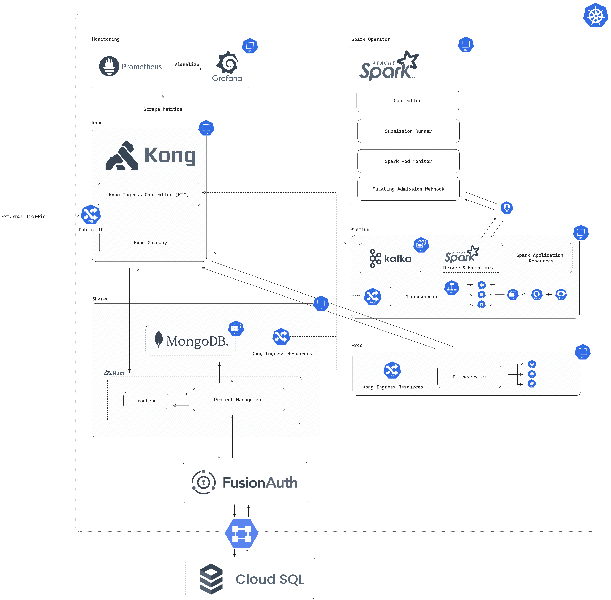

[](https://github.com/BenjaminBruenau/RuettelReport)

# Rüttel Report

[](https://github.com/BenjaminBruenau/RuettelReport/actions/workflows/backend-ci.yml)
[](https://github.com/BenjaminBruenau/RuettelReport/actions/workflows/frontend-ci.yaml)
[](https://codecov.io/gh/BenjaminBruenau/RuettelReport)


## Local Setup Guide 
**(with local Postgres DB for FusionAuth)**

### Clone Project

````shell
git clone https://github.com/BenjaminBruenau/RuettelReport
````

### Start local Cluster

We recommend to start the local Cluster with a good chunk of memory, as otherwise running both SparkApplications and 
Kafka will result in Pods being killed (_OOMKilled_).
```shell
minikube start --cpus 5 --memory 8g
```
To use images from a private Artifact Registry (like our development and production Repositiories there) it is necessary to mount the K8s Pods with the required Google Cloud Credentials.
```shell
minikube addons enable gcp-auth
```

### Installing RuettelReport Infrastructure


```shell
helm repo add spark-operator https://googlecloudplatform.github.io/spark-on-k8s-operator
helm repo add kong https://charts.konghq.com
helm repo add prometheus-community https://prometheus-community.github.io/helm-charts
helm repo add fusionauth https://fusionauth.github.io/charts
helm repo add bitnami https://charts.bitnami.com/bitnami

helm install spark spark-operator/spark-operator --namespace spark-operator --create-namespace -f spark-operator-values.yaml

helm install mongodb bitnami/mongodb -f mongodb-values.yaml -n shared --create-namespace

helm install kong kong/ingress -n kong --create-namespace 

helm install pg-minikube --set auth.postgresPassword=admin bitnami/postgresql
helm install my-fusion fusionauth/fusionauth -f local-fa-values.yaml
```
#### With Monitoring (optional)

```shell
helm install promstack prometheus-community/kube-prometheus-stack --namespace monitoring --version 52.1.0 -f values-monitoring.yaml
helm upgrade kong kong/ingress -n kong --set gateway.serviceMonitor.enabled=true --set gateway.serviceMonitor.labels.release=promstack
kubectl apply -f kong-prometheus-plugin.yaml
```

### Installing the RuettelReport Application Chart

**!The `ruettel-chart-local-values.yaml` needs to be adjusted before!**

1. [Port Forward](#FusionAuth) FusionAuth
2. Access its UI in the browser
3. Go to `Settings` -> `Key Manager`
4. View the `premium` and `free` key and copy both their public key entries
5. Replace the values for `kong.premiumConsumerSecret` and `kong.freeConsumerSecret` (in `ruettel-chart-local-values.yaml`)
with their corresponding public key value
6. Proceed with the Application Chart Installation

```shell
helm install ruettel-chart ./ruettel-chart -f ruettel-chart-local-values.yaml --set image.tag=<your desired release version / latest>
```

### Accessing Infrastructure Services

#### Monitoring

````shell
kubectl -n monitoring port-forward services/prometheus-operated 9090 & kubectl -n monitoring port-forward services/promstack-grafana 3000:80 &

kubectl get secret --namespace monitoring promstack-grafana -o jsonpath="{.data.admin-password}" | base64 --decode ; echo
````

#### FusionAuth

````shell
export SVC_NAME=$(kubectl get svc --namespace default -l "app.kubernetes.io/name=fusionauth,app.kubernetes.io/instance=my-fusion" -o jsonpath="{.items[0].metadata.name}")
kubectl port-forward svc/$SVC_NAME 9011:9011
````

#### MongoDB

````shell
kubectl port-forward svc/mongodb-headless 27017:27017
````

#### Spark Operator

````shell
kubectl describe sparkapplication spark-analysis -n premium
````

Get Logs of specific SparkApplication Job:
````shell
kubectl logs spark-analysis-driver -n premium
````


## Architecture


