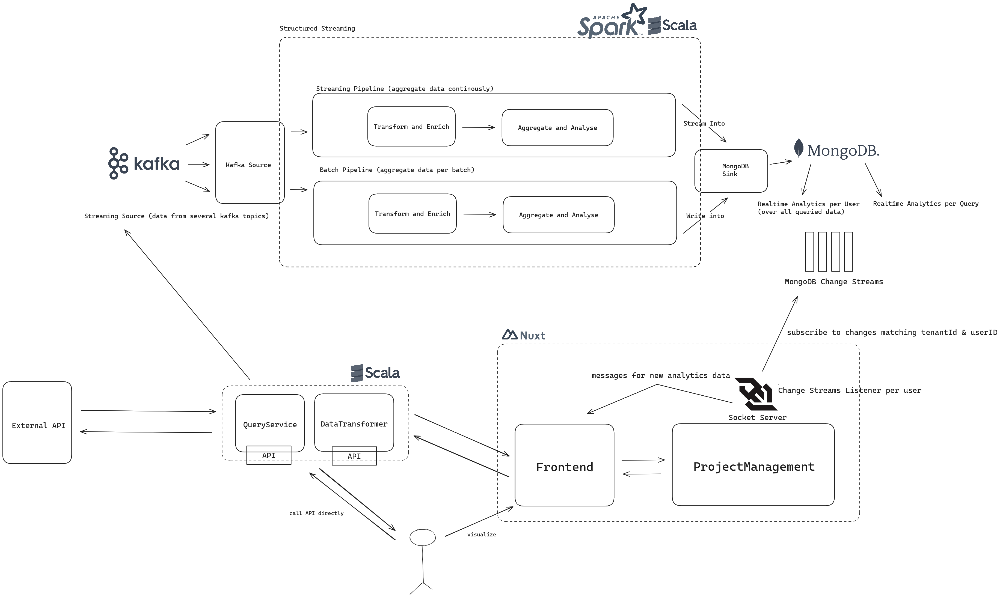
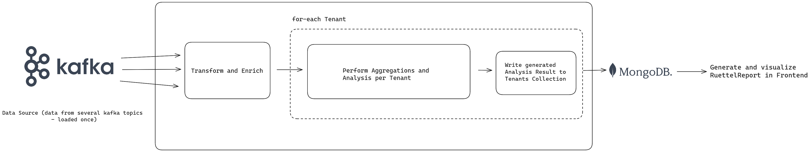
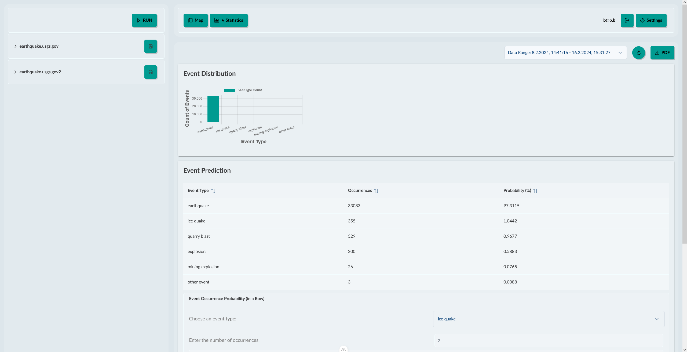

[](https://github.com/BenjaminBruenau/RuettelReport)

# Rüttel Report

[](https://github.com/BenjaminBruenau/RuettelReport/actions/workflows/backend-ci.yml)
[](https://github.com/BenjaminBruenau/RuettelReport/actions/workflows/frontend-ci.yaml)
[](https://codecov.io/gh/BenjaminBruenau/RuettelReport)


## !Important!

As of 21.2.2023 our test-period for Google Cloud has expired, meaning our Artifact Repositories for both develop and production
are no longer accessible. To setup and run/deploy the application the artifacts need to be released to an own registry 
(e.g. by changing the action environment variables for `GCLOUD_REGION`, `GAR_LOCATION` and `PROJECT_ID`).
The values for `image.repository` in the [ruettel-chart](.helm/ruettel-chart/values.yaml) or the [ruettel-chart-local-values.yaml](.helm/ruettel-chart-local-values.yaml)
then need to be adjusted accordingly.

## Setup Guide 
**(with local Postgres DB for FusionAuth)**

To setup the application in Google Cloud with FusionAuth using a GCloud SQL DB see [this](#cloudsql-for-fusionauth-guide).

This setup flow is also suitable for a deployment to the Kubernetes Engine of a Cloud Provider, the kubeconfig only needs to
point to the K8s Cluster in the Cloud.
### Clone Project

````shell
git clone https://github.com/BenjaminBruenau/RuettelReport
````

### Start local Cluster

We recommend to start the local Cluster with a good chunk of memory, as otherwise running both SparkApplications and 
Kafka will result in Pods being killed (_OOMKilled_).
```shell
minikube start --cpus 5 --memory 8g
```
To use images from a private Artifact Registry (like our development and production Repositiories there) it is necessary to mount the K8s Pods with the required Google Cloud Credentials.
```shell
minikube addons enable gcp-auth
```

### Installing RuettelReport Infrastructure


```shell
helm repo add spark-operator https://googlecloudplatform.github.io/spark-on-k8s-operator
helm repo add kong https://charts.konghq.com
helm repo add prometheus-community https://prometheus-community.github.io/helm-charts
helm repo add fusionauth https://fusionauth.github.io/charts
helm repo add bitnami https://charts.bitnami.com/bitnami

helm install spark spark-operator/spark-operator --namespace spark-operator --create-namespace -f spark-operator-values.yaml

helm install mongodb bitnami/mongodb -f mongodb-values.yaml -n shared --create-namespace

helm install kong kong/ingress -n kong --create-namespace 

helm install pg-minikube --set auth.postgresPassword=admin bitnami/postgresql
helm install my-fusion fusionauth/fusionauth -f local-fa-values.yaml
```
#### With Monitoring (optional)

```shell
helm install promstack prometheus-community/kube-prometheus-stack --namespace monitoring --version 52.1.0 -f values-monitoring.yaml
helm upgrade kong kong/ingress -n kong --set gateway.serviceMonitor.enabled=true --set gateway.serviceMonitor.labels.release=promstack
kubectl apply -f kong-prometheus-plugin.yaml
```

### Installing the RuettelReport Application Chart

**!The `ruettel-chart-local-values.yaml` needs to be adjusted before!**

1. [Port Forward](#FusionAuth) FusionAuth
2. Access its UI in the browser
3. Login with the values defined for the admin account in the kickstart property inside `local-fa-values.yaml`
4. Go to `Settings` -> `Key Manager`
5. View the `premium` and `free` key and copy both their public key entries
6. Replace the values for `kong.premiumConsumerSecret` and `kong.freeConsumerSecret` (in `ruettel-chart-local-values.yaml`)
with their corresponding public key value
7. Proceed with the Application Chart Installation

```shell
helm install ruettel-chart ./ruettel-chart -f ruettel-chart-local-values.yaml --set image.tag=<your desired release version / latest>
```

### Accessing Infrastructure Services

#### Monitoring

````shell
kubectl -n monitoring port-forward services/prometheus-operated 9090 & kubectl -n monitoring port-forward services/promstack-grafana 3000:80 &

kubectl get secret --namespace monitoring promstack-grafana -o jsonpath="{.data.admin-password}" | base64 --decode ; echo
````

#### FusionAuth

````shell
export SVC_NAME=$(kubectl get svc --namespace default -l "app.kubernetes.io/name=fusionauth,app.kubernetes.io/instance=my-fusion" -o jsonpath="{.items[0].metadata.name}")
kubectl port-forward svc/$SVC_NAME 9011:9011
````

#### MongoDB

````shell
kubectl port-forward svc/mongodb-headless 27017:27017
````

#### Spark Operator

````shell
kubectl describe sparkapplication spark-analysis -n premium
````

Get Logs of specific SparkApplication Job:
````shell
kubectl logs spark-analysis-driver -n premium
````

## CloudSQL for FusionAuth Guide
(with PostgresDB provided by GoogleCloud for FusionAuth - [Reference](https://fusionauth.io/docs/get-started/download-and-install/kubernetes/gke#create-a-database))

- this will only work with a vpc native gke cluster as the created db will have no external endpoint
- when using terraform to setup the cluster it will be VPC_NATIVE by default per the configuration (see [cluster.tf](.terraform/cluster.tf))

```shell
export PROJECT_ID=<your-project-id>
export DB_NAME=<your-db-name>
export REGION=<your-gcloud-region>
```

**Setup the database**
````shell
gcloud beta sql instances create "${DB_NAME}" \
  --project="${PROJECT_ID}" \
  --database-version=POSTGRES_12 \
  --tier=db-g1-small  \
  --region="${REGION}" \
  --network=default \
  --no-assign-ip
````

**Configure the default user**
````shell
gcloud sql users set-password postgres \
  --instance="${DB_NAME}" \
  --password=<your-password>
````


**Verify installation**
````shell
gcloud sql instances list
````

The following values need to be adjusted in [fa-values.yaml](.helm/fa-values.yaml):
- `database.host` (-> internal endpoint of the db)
- `database.root.user` (-> postgres)
- `database.root.password` (-> password you set up for the default user)
- `database.user`
- `database.password`
- optionally: `kickstart.data` if FusionAuth should not be configured manually

### Point Kubeconfig to GKE Cluster

`gcloud container clusters get-credentials <cluster-name> --region europe-west6`

## Architecture


## (Soft) Realtime Analytics - Data Flow

- when querying data (either via the API of the QueryService or DataTransformer) the results will be written to Kafka
- the SparkStructured Streaming Analysis Service will aggregate the queried data in a streaming manner in two ways:
  - Per Batch = Aggregations per Query of the user
  - Complete = Aggregations are continuously updated for each incoming Query Data
- the results are then written to a mongodb collection and enriched with the tenantID and userID to only provide the 
analysis results to the user inside a tenancy who queried the data that was aggregated
- when accessing the ui the latest complete aggregations are fetched
- a socket connection to the project-management service is established to get the latest analysis results once they are written to the database
  - this is done by establishing a Listener to the MongoDB Change Streams for each user (after authenticating the socket-connection)
  - only inserts in the realtime-analytics collections that match the users id and his tenantid are listened to
  - once a change streams event matches that criteria a message with the new analysis results is sent back to the client so it can be visualized




## Report Generation (the actual Rüttel Report)

- every day at 8 a.m. a cron-job as a scheduled SparkApplication is run
- this job will aggregate the available data for each tenant in kafka (retention time = 1 week), report collection per tenant
- spark will compute metrics which can later be used for interesting statistical computation for basic predictions 
(e.g. probability for x events of a certain type happening in a row or probability of an event happening at a specific timestamp/time-range)
- each report can then be visualized in the Frontend and exported as a PDF




<br>



Non-transparent versions of the architecture images are available [here](.github/assets).
